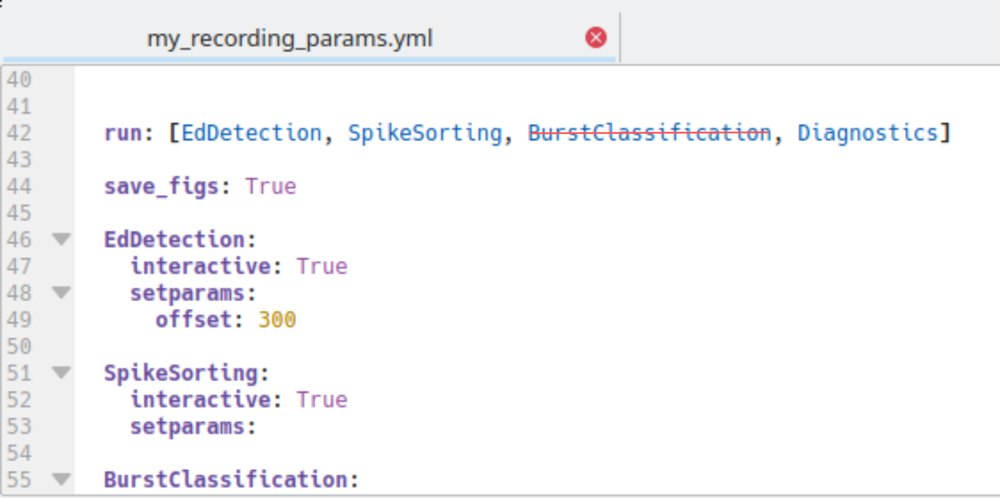
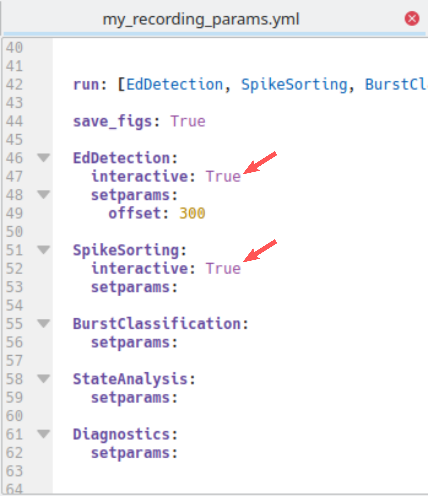
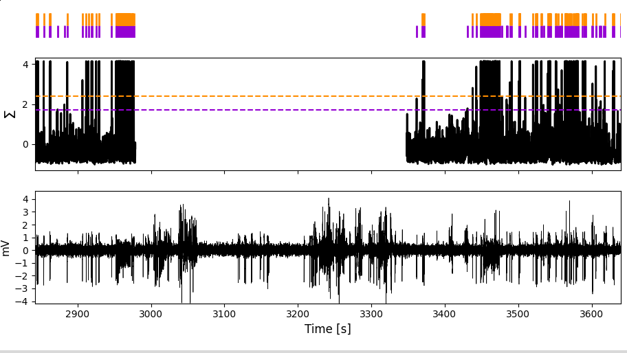
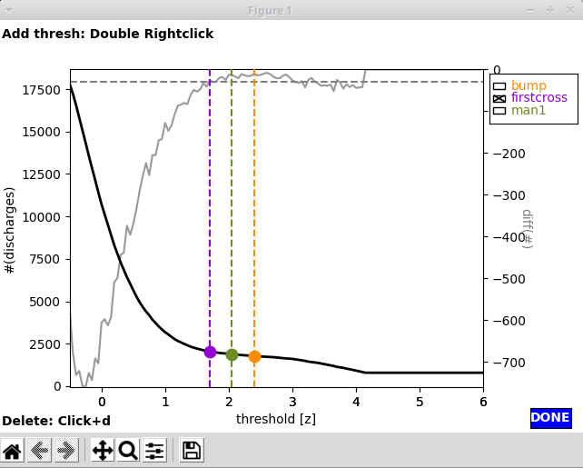
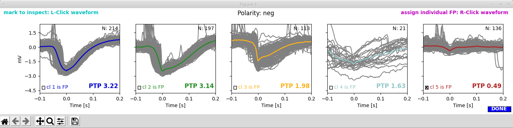
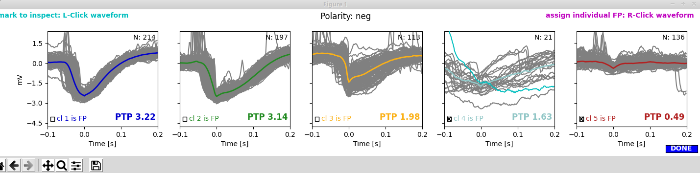

.. _LFP_to_bursts:

*******************************
EA detection and classification
*******************************

Spike detection and burst detection/classification are called with a single command. If you are not interested in bursts and
prefer to just run the spike detection you can do so by excluding `BurstClassificaton` from the list of `analysis:run` in
the parameter file at the template or recording specific level (see :ref:`setting_parameters`):

:ref:`spike_detection` is followed by :ref:`burst classification <burst_classification>`.
Spike detection consists of three consecutive steps: *spectral spike detection* (the main step) complemented by
*amplitude based spike detection* for reducing false negatives and *spike sorting* for reducing false positives.
Amplitude based spike detection and burst classificaton runs fully automatically.
For spectral spike detection and spike sorting there is a **GUI** that allows you to set parameters manually.
Depending on whether you want to use the GUI or rely on default parameters, have `interactive` set to True or False in the
parameter file:

Execute the spike detection and burst classification through the command-line::

    > python PEACOC/runthrough/LFPtoBursts.py run_params/my_recording_params.yml

Now your PC may be busy for a few minutes (about 3 min for a 2h recording on an ok Laptop). If you chose not to use a GUI (interactive:False)
nothing will pop up and you can skip forward to :ref:`output`:

.. _spike_detection:

Spike detection
===============

.. _spikes_spectral:

Spectral spike detection (interactive)
--------------------------------------
Using the GUI for spectral spike detection (EdDetection:interactive:True in the parameter file) two windows will pop up.
The first window shows :math:`n(\theta)`, i.e. the number of spikes as a function of the spectral threshold.
The two lines indicate what the algorithm interprets as sensible thresholds. By default, `firstcross` (the beginning
of the plateau region, corresponding to :math:`\theta_a` in the *paper_*)
would be chosen, but also `bump` (the middle of the plateau, corresponding to :math:`\theta_b`) might be a good choice.

.. image:: _static/screenshots/threshdet_ntheta.png
    :width: 500
    :align: center

.. todo::
    Link to the *paper_*

The second window displays the *LFP* (bottom), the *normalized spectral sum* to which the threshold is applied (middle, thresholds
shown as horizontal lines) and the *spikes detected* when applying the threshold (top).

Zoom around in this window to see how happy you are with the performances of each of the thresholds:

And by the way, the missing values in the normalized spectral sum in this example are due to the artifact we had assigned
in this region:

**Manually adding a threshold:** In case you are unhappy with the performance of `firstcross` and `bump`, you can add a
custom threshold yourself by a `double right click` on :math:`n(\theta)` in the first window:

In this case we added a threshold (green) between `firstcross` and `bump`. Upon adding a new threshold for inspection
it will also show up in the second window, so you can judge its performance:

**Picking a threshold:** For setting a threshold click the respective checkbox. Here we pick our manual threshold `man1`:

To finish the spectral spike detection, click the blue `Done` button in the first window.

.. important::

    I highly recommend to be rather liberal with the threshold at this stage, ie. opt for a rather low threshold such as
    `firstcross` and dont worry about some false positives. False positives will later be removed through :ref:`spikesorting`.

.. _spikesorting:

Spike sorting (interactive)
---------------------------

With spike sorting we try to detect (and later remove) false positives through clustering waveforms.
If you are in interactive mode for spike sorting (SpikeSorting:interactive:True in the parameter file), two more windows
will pop up now. The panels of the first window show the clusters (waveforms of individual spikes as thin yellowish lines,
average waveforms in colors). The clusters are arranged descending from highest to lowest peak-to-peak (PTP) amplitude of the average
waveform. By default the cluster with the lowest PTP amplitude would be discharded (cluster 5 shown in red):

The second window shows the LFP trace with spikes annotated (colored vertical lines) according to the cluster to which they were assigned.
The grey lines indicate spikes that had not been subjected to clustering because they occurred in dense *groups* and thus their waveforms
could not be separated (we do not worry too much about false positive detections in dense bursts, as they have only very minor influence
on burst classification in the end). The area shaded in yellow marks the region we excluded from analyses by assigning an :ref:`artifact <artifacts>`.

.. image:: _static/screenshots/sorting_trace.png
    :width: 700
    :align: center

To have a closer look at the spikes in their natural habitat, let's zoom around in the second window:

.. image:: _static/screenshots/sorting_traceZoom1.png
    :width: 700
    :align: center

I think clusters 1 to 3 look really decent and cluster 5 clearly is a false positive. But what what about cluster 4?

**Marking waveforms for further inspection:** There are really few cluster 4 spikes, and it is hard to spot them in the LFP trace (second window).
So let's mark one of those suspicious waveforms by a `left click` in the first window. The waveform now turns cyan:

... and the waveform gets marked by a cyan triangle in the second window:

.. image:: _static/screenshots/sorting_trace_marked.png
    :width: 500
    :align: center

Let's zoom in on this:

Oh dear, the spikes of cluster 4 appear to belong to an artifact that we did not exclude. To be super correct, we should now
:ref:`edit the artifact file manually <adding_artifacts_manually>`. But as this is serves for demonstration purposes only,
let's content ourselves with annotating the spikes belonging to cluster 4 as false positives too.

**Picking noise clusters:** You can remove clusters as noise by checking the corresponding check boxes in the first window.
In our case, we select clusters 4 and 5 to be discarded as false positives.

By clicking the blue `Done` button, we save our choice and finish this procedure.

.. note::
    If you selected **mixed polarity** when :ref:`assiging the polarity <polarity>`, you will see two rows of clusters, one for positive and one for negative polarity.
    Likewise, the LFP trace will be annotated with spikes belonging to positive clusters (above the zero line) and spikes belonging to negative clusters (below
    the zero line). By default the fifth cluster of both negative and positive clusters will be discarded. You can choose separately for
    for positive and negative clusters which clusters to discharge as false positives.

.. _burst_classification:

Burst detection and classification
==================================

The burst classification runs fully automatically by projecting detected spike bursts on a predefined *self-organizing map* (SOM). For the *intrahippocampal
kainate mouse model* we once calculated a **reference SOM** on which we project all new datasets. This worked well so far and we included the reference SOM in
the toolbox (path: *PEACOC/config/som.h5*).
If you use a different kind of animal model with different types of bursts, you might want to select other features and derive your own SOM.
To calculate the SOM itself we used the `SOMz-package <http://matias-ck.com/mlz/somz.html>`_ by
Carrasco Kind and Brunner (“SOMz: photometric redshift PDFs with self-organizing maps and random atlas”, doi:10.1093/mnras/stt2456).
You can use a your own SOM for the projection method by setting the path to your SOM in the parameter file:

.. image:: _static/screenshots/SOM_path.png
    :width: 500
    :align: center

