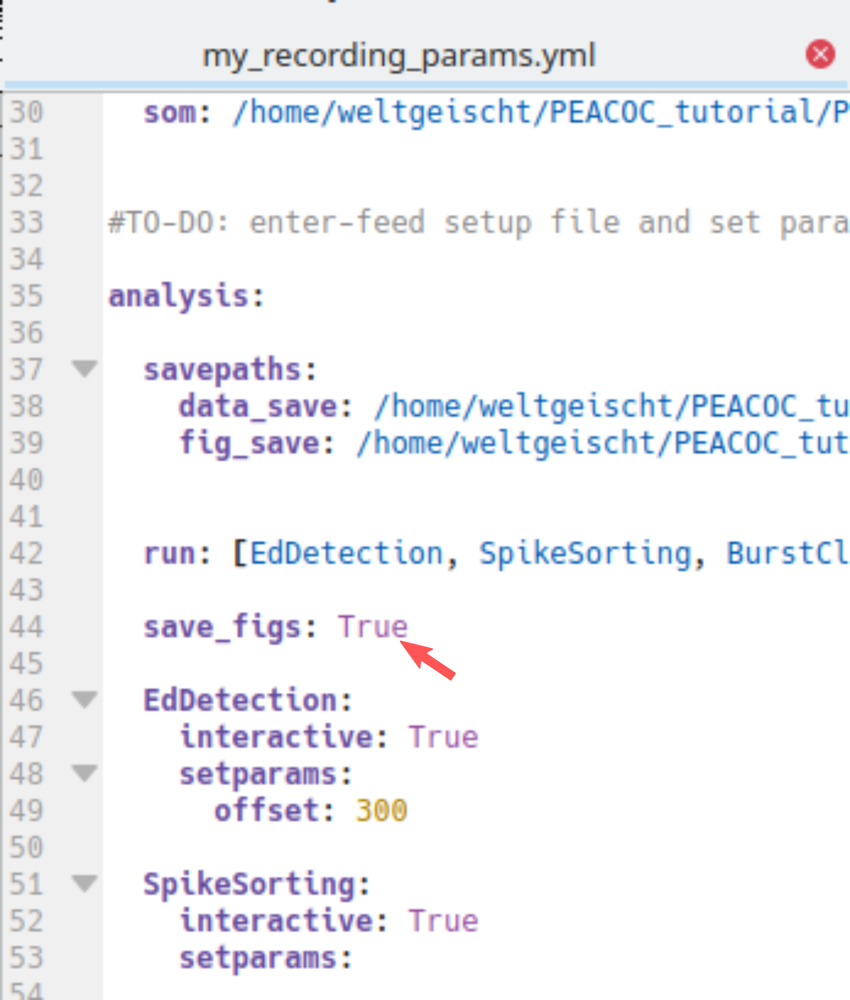
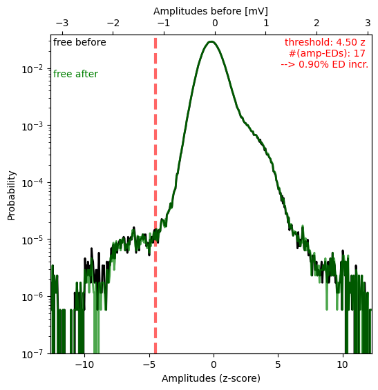

.. _output:

******
Output
******

During this analysis run the following folders and files were generated::

    my_results
    ├── data
    │ └── my_recording
    │     ├── my_recording__analysis.log
    │     ├── my_recording__artifacts.txt
    │     ├── my_recording__blipSpy.h5
    │     ├── my_recording__polarity.txt
    │     └── my_recording__raw500.h5
    └── figures
        └── my_recording
            ├── my_recording__burstClassification
            │   ├── my_recording__examplesOnMap_thisSOM.png
            │   ├── my_recording__mapIds_to_ROIids.txt
            │   └── my_recording__traceClassified_thisSOM.png
            ├── my_recording__spikeDetection
            │   ├── my_recording__ampDetection.png
            │   ├── my_recording__detExamples.png
            │   └── my_recording__FofThresh.png
            └── my_recording__spikesorting
                ├── my_recording__clusterremoval_ncomp3.png
                ├── my_recording__fpRemoval_ex1.png
                ├── my_recording__fpRemoval_ex2.png
                └── my_recording__fpRemoval_ex3.png

The exact location of the figure and data files depend on the location you entered when :ref:`editing the parameter files <replacement_params>`
(specifically how you replaced `DATADIR` and `FIGDIR` in the template).

.. _resultshdf5:

Results (HDF5)
==============

The folder *my_results/data/my_recording* contains the results of the analyses, most importantly *my_recording__blipSpy.h5*.
In this file all important results and intermediate steps (like the normalized averaged spectrogram) are stored.
*my_recording__blipSpy.h5* looks like this:

.. image:: _static/screenshots/hdf5Output.png
    :width: 500
    :align: center

This file contains the timings and classes of bursts (field *burstcalsses*), the train of spikes after spikesorting (*dischargedict_cleaned*),
the train of spikes before spikesorting (i.e. the spikes resulting from spectral and amplitude based spike detection, *dischargedict_raw*)
and a link to the raw_data contained in *my_recording__raw500.h5* (field *raw_data/link*). Most of these fields contain three subfields
- *data*, where the actual results are stored
- *info*, where you find metadata (e.g. the version of the code used and the paths to the figures generated by these analyses)
- *methods*, giving the parameters used for a particular analysis step

You can either directly extract the data from these hdf5 files yourself (have a look at :ref:`this <direct_hdf5access>` for inspiration),
or use the :ref:`data handling tool <access_results>` we provide to conveniently access and visualize results.

.. _quality_control:

Quality control figures
=======================

To assess whether the algorithm performed sensibly, figures were created and saved in the folder *my_results/data/my_recording*.
You can turn this off in the parameter file (`analysis:save_figs: False`) ...

... but I highly recommend you keep saving these figures and routinely check them to see whether everything works well.
In the following you will learn how to interpret these figures.

Spike detection
---------------
The folder **my_recording__spikeDetection** contains three figure files::

    my_recording__spikeDetection
     ├── my_recording__ampDetection.png
     ├── my_recording__detExamples.png
     └── my_recording__FofThresh.png

The figure *my_recording__FofThresh.png* displays the number of spikes as a function of threshold (:math:`n(\theta)`, see also :ref:`spectral spike detection <spikes_spectral>`).
The circle indicates the threshold selected. As we manually picked the threshold in this example, the `mode` is `man`.
The green line displays the derivative of :math:`n(\theta)` based on which the plateau region was determined:

.. image:: _static/quality_control/my_recording__FofThresh.png
    :width: 500
    :align: center

For a proper spike detection we need a plateau region (*paper_Figure XXX_*), that is a region where :math:`n(\theta)` increases only very slowly.
Non-epileptic mice lack such a pleateau. Here we are content, because a plateau is clearly visible and the threshold is located
nicely within the plateau region.

The figure *my_recording__ampDetection.png* displays the amplitude distribution of the LFP with spectral spikes masked (black) and
spectral + amplitude spikes masked (green, *paper_Figure XXX_*). The red line indicates the value where
the amplitude threshold was automatically set (-4.5 due to negative :ref:`polarity <polarity>`) and the red numbers in the upper right
corner state again the threshold, the absolute number of amplitude spikes #(amp-EDs), and how the number of spikes increased
through amplitude based spike detection:

In this case the shoulder for negative values is very small (note the logarithmic y-axis) and consequently very few spikes
were detected as amplitude spikes (0.9% increase only).

The figure *my_recording__detExamples.png* shows five randomly selected 40s snippets of LFP with spectal and amplitude spikes
annotated by blue and red ticks respectively. Regions :ref:`annotated as artifacts <artifacts>` are shaded in yellow.

Because there were so few amplitude spikes (i.e. spectral spike detection did a good job), we dont see any red ticks here.
But we notice some false positives, eg. in the first and second row. Luckily these were probably removed by
:ref:`spike sorting <spikesorting>`.

Spike sorting
-------------
The folder **my_recording__spikesorting** contains one file again displaying the spike clusters and three figures
of LFP traces annoted with putative false positives detected through spike sorting::

     my_recording__spikesorting
        ├── my_recording__clusterremoval_ncomp3.png
        ├── my_recording__fpRemoval_ex1.png
        ├── my_recording__fpRemoval_ex2.png
        └── my_recording__fpRemoval_ex3.png

The figure *my_recording__clusterremoval_ncomp3.png* (ncomp3 refers to the default of three principal components used for sorting)
have already seen when running :ref:`spike sorting in interactive mode <spikesorting>`:

If you ran everything automatically (by default only cluster 5 is removed) you would get suspicious and now run the
sorting again to remove cluster 4 as well.
But as indicated by the `checkmarks`, we already removed cluster 4 as well and are very content, because clusters
1-3 show nice spike-like waveforms, while clusters 4 and 5 do not look like spikes.

The figures *my_recording__fpRemoval_ex1-3.png* show five randomly selected 20s snippets of LFP with non-removed (*accepted EDs*, blue)
and false positives detected through spike sorting (red) indicated by tickmarks. The grey regions indicates the waveform
cutouts subjected to spike sorting.
Regions :ref:`annotated as artifacts <artifacts>` are shaded in yellow.
Here is one of these example figures:

Note that spikes occuring in groups were not subjected to spike sorting (last row). Overall, we are very happy
with the performance, most false positives appear to have been detected. If you noticed an awful lot of false positives
in these example figures, you might need to :ref:`change the threshold for spectral spike detection <spikes_spectral>`
or :ref:`exclude more/different clusters <spikesorting>`. Likewise, if you observed too many false negatives or spikes being wrong-
fully labeled false positives here.

Burst classification
--------------------

The folder **my_recording__burstClassification** contains two figures related to burst classification::

    my_recording__burstClassification
       ├── my_recording__examplesOnMap_thisSOM.png
       ├── my_recording__mapIds_to_ROIids.txt
       └── my_recording__traceClassified_thisSOM.png

The figure *my_recording__examplesOnMap_thisSOM.png* displays the SOM (left) and how spikes bursts (randomly chosen)
were assigned to nodes of the SOM (right). The colors indicate the different burst classes. Note that the high-load
cluster is sub-differentiated here in `high-load 1` (red) and `high-load 2` (orange).:

The file *my_recording__mapIds_to_ROIids.txt* translates the burst ids given in this figure to the actual burst ids in the
data (in case you want to hunt down a particular burst). Everything looks nice, bursts appear to be assigned properly
and according to our intuition of severity. Pay special heed to this figure when applying our algorithm to a different
mouse model. If things look strange here, you :ref:`may need to use different kinds of features and/or build your
own SOM <burst_classification>`.

The figure *my_recording__traceClassified_thisSOM.png* shows the whole trace of the LFP with the burst classes (colors) and
solitary spikes (black tickmarks) displayed on top. The purpose of this figure is to give you an overview of the sequence of
classified EA events. Note that here the EA is classified in t-shirt sizes to allow for a more detailed classification.
The category `low-load` in the *paper_* comprises all `XS` (bursts with fewer than five spikes which were not classified
on the SOM) and `S` (low-load bursts classified through the SOM) bursts shown here. The `medium-load` bursts are category
`M` and the category `high-load` comprises all `L` (=`high-load2`) and `XL` (=`high-load1`) bursts:

.. image:: _static/quality_control/my_recording__traceClassified_thisSOM.png
    :width: 750
    :align: center

.. todo::
    Links for *paper_Figure XXX_* and *paper_*, in the whole section