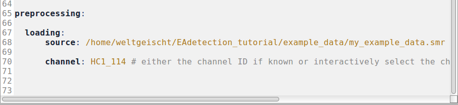
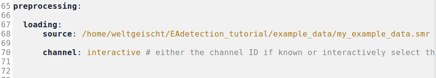
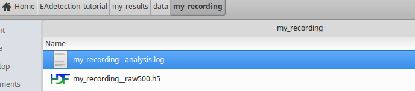
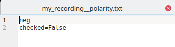
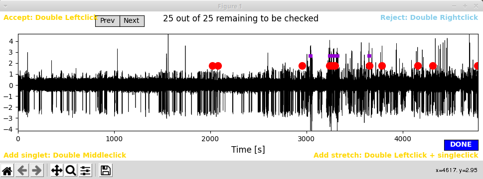
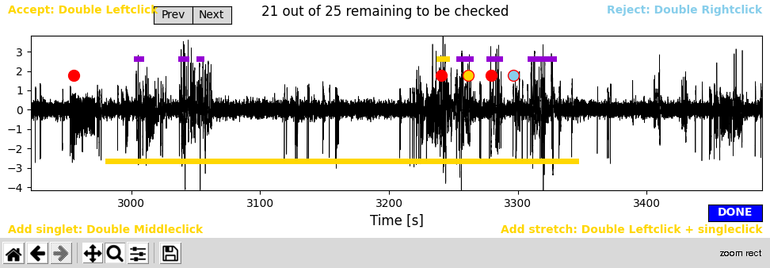
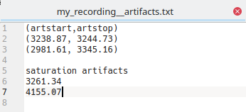

.. _preprocessing:

*************
Preprocessing
*************

Both preprocessing and :ref:`LFP_to_bursts` work as a command line tool. The basic command structure is like this::

> python <path/to/codefile.py> <path/to/paramfile.yml>

.. _resample:

Load and resample
=================

The goal of this is to transfer obtain a resampled version of the raw data in hdf5 format. To date the loading supports
.smr and .edf files.

Just run::

    > python PEACOC/runthrough/rawToResampled.py run_params/my_recording_params.yml

My command line when resampling looks like this (the "(peacoc)" indicates that I work in the virtual enviroment "peacoc" )::

    (peacoc) weltgeischt@heulsuse:~/PEACOC_tutorial> python PEACOC/runthrough/rawToResampled.py run_params/my_recording_params.yml

Depending on what you put in your specific parameter file, loading and resampling either just run through :ref:`automatically <auto_load>`, which is nice when processing
several recordings in a loop, or you can select the channel :ref:`interactively <interactive_load>`.

.. _auto_load:

Automatic mode
--------------

For this you need to know the channel you want to access and enter it directly in the parameter file:

.. _interactive_load:

Alternative: Interactive mode
-----------------------------
In case you do not know the channel name and want to select a channel interactively, *channel* should be set to *interactive*
in the specific parameter file:

In interactive mode you then type the name of the channel you want to select and exit with ``d``:

.. image:: _static/screenshots/resample_interactive.png
    :width: 350
    :align: center

You now have created a resampled .hdf5 at */my_results/data/my_recording/* and a log-file of the analysis (which is nice for handing
in, in case your analysis is not working properly):

.. note::
    You can skip this loading and resampling routine and use your own resampled hdf5 file. Take care, however, to
    adhere to the format given in *PEACOC_tutorial/my_results/data/my_recording/my_recording__raw500.h5*

.. _polarity:

Assign polarity
===============

Polarity refers to the direction of the spike component in EA. To interactively determine and set the polarity of your
recording, run the following command::

    > python PEACOC/runthrough/polarityCheck.py run_params/my_recording_params.yml

Two windows will pop up: A LFP trace of the whole recording...

.. image:: _static/screenshots/polarity_trace.png
    :width: 500
    :align: center

... and an amplitude distribution, with checkboxes:

.. image:: _static/screenshots/polarity_click.png
    :width: 500
    :align: center

In this example you can see a shoulder at negative amplitudes, this strongly suggests, that the polarity of this
example recording is negative. To be sure you could also zoom around in the LFP trace that just popped up. As you can see,
the polarity indeed appears to be negative (the spike component goes down).

.. image:: _static/screenshots/polarity_traceZoom.png
    :width: 500
    :align: center

By marking a checkbox in the upper right corner of the window with the amplitude distribution,
you select a polarity. Clicking ``Done`` (bottom right) ends the whole procedure, and a simple .txt file is created
at *PEACOC_tutorial/my_results/data/my_recording/my_recording__polarity.txt*:

.. note::

    If you know the polarity of your recordings anyway, you can yourself create a file *my_recording__polarity.txt* and
    do not need to follow the interactive routine to determine the polarity.  If the file *my_recording__polarity.txt* is not present,
    later analyses will assume default polarity (negative).

.. _artifacts:

Detect artifacts
================

To run the semi-automatic artifact detection, execute this::

    > python PEACOC/runthrough/artifactCheck.py run_params/my_recording_params.yml

A window displaying the whole extent of the recording session will pop up. In it single events the algorithm detected
as potential *saturation artifacts* are marked by ``red dots`` and potential *longer stretches of artifacts* are marked by ``purple lines``:

**Accepting suggested artifacts:** Zoom around to have a look whether you want to accept any of the proposed artifacts. Accepting an artifact means that this
stretch of data (plus a margin for the *saturation artifact*) will be masked for further analyses. To accept an artifact,
``double left click`` on its marker. Once you accepted the artifact its marker will turn ``yellow``.

**Rejecting suggested artifacts:** ``double right click`` to reject a suggested artifact. Once rejected, the marker of the artifact will turn ``blue``:

.. warning::
    Only artifacts marked in yellow, i.e. accepted artifacts, will be saved as artifacts. The functionality of rejecting artifacts is just there
    to better keep track of which artifacts you accepted. By default, all potential artifacts the algorithm highlights will not be masked in later analyses
    unless you explicitly accept them.

.. image:: _static/screenshots/arts_accepted_rejected.png
    :width: 700
    :align: center

.. note::
    Make sure to release the zoom tool (by clicking on it), once you try to accept/reject artifacts. Otherwise selection
    will not work.

**Adding artifacts yourself:** To add a single artifact event ``double middle click`` at the position where you have identified it. A ``yellow dot`` will appear.
For adding longer stretches of artifacts ``double left click`` at the position where you think the artifact starts and then ``single left click``
where you think the artifact ends. This artifact stretch will be indicated by a yellow line. We typically exclude large stretches of data in that way
when they appear to be peppered by artifacts.

.. important::
    For adding your own artifacts, always **click below y=0**. This serves to keep self-identified and automatically suggested artifacts separate.

Once you are finished with artifact hunting, click on the blue ``Done`` button. Again a simple .txt file is created at
*PEACOC_tutorial/my_results/data/my_recording/my_recording__artifacts.txt*:

Below the header ``(artstart,artstop)`` the start and end points of large artifact stretches are indicated (yellow lines in the GUI, see above). Below the header
``saturation artifacts`` time points of single artifact events are given (yellow dots in the GUI). Don't worry if some artifact stretches overlap in time (as shown in this example)
- the tool can resolve this automatically.

.. _adding_artifacts_manually:

.. note::
    You can edit the file *my_recording__artifacts.txt* by hand or altogether avoid the interactive routine described here and create such a file yourself.
    If the file *my_recording__artifacts.txt* is not present, later analyses will assume that there are no artifacts.