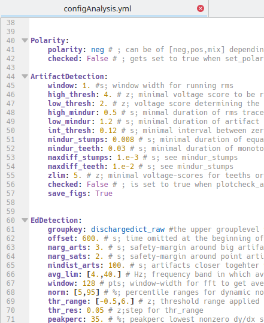
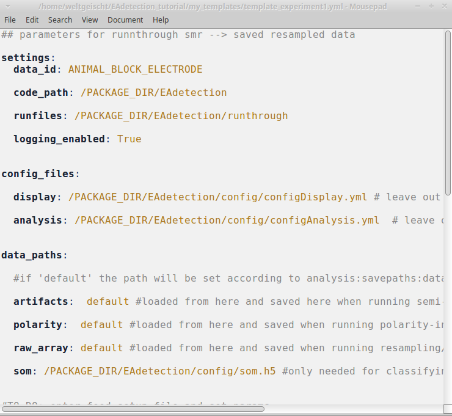
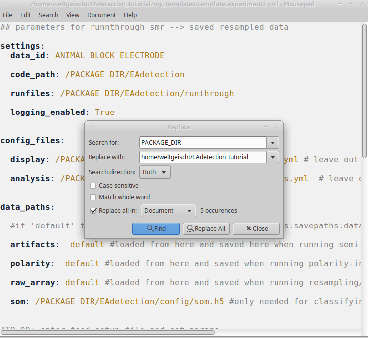
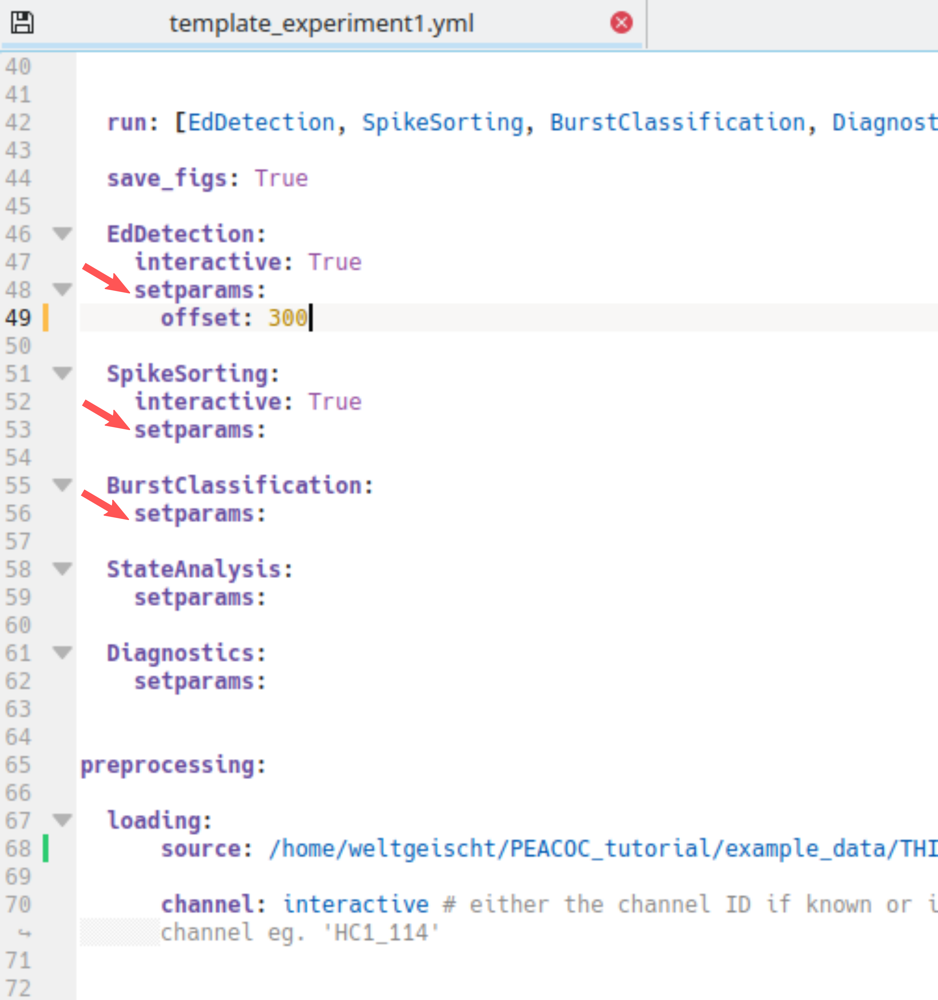

.. _setting_parameters:

******************
Setting parameters
******************

.. _param_intro:

How parameters are handled
==========================

Parameters are handled at two different levels. The **default parameters** are located at
*PEACOC/config/configAnalysis.yml* and look like this:

Behind each parameter and default value there is an explanation of what it is good for.
Make a change to this file only if you are absolutely sure that you want this change for all
for all of your analyses. For now, leave it untouched.
In the next sections we will create experiment and recording specific parameter files where you
can overwrite the defaults.

.. _param_template:

Create a template
=================

We found it very useful and time-saving to create parameter templates for whole experiments, i.e. a larger number of
recordings to which the same parameters should be applied.
To work with templates, first create a directory where you would like to store your templates::

    > mkdir my_templates

Then copy a templates from PEACOC/templates to your directory. On Linux::

    > cp PEACOC/templates/template__runparams.yml my_templates/template_experiment1.yml

On Windows::

    > cp PEACOC/templates/template_runparamsWin.yml my_templates/template_experiment1.yml

Open the copied template (in this case *my_templates/template_experiment1.yml*), it looks like this:

All entries in CAPITALS are place-holders, which we will now successively replace according to our setup and
preferences:

.. _replacement_params:

Make the following replacements:

- ``PACKAGE_DIR``: where you cloned/downloaded the toolbox, e.g.: ``home/weltgeischt/PEACOC_tutorial``
- ``DATADIR`` → where you want your results saved, e.g.: ``home/weltgeischt/PEACOC_tutorial/my_results/data``
- ``FIGDIR``: where you want the figures saved, e.g.: ``home/weltgeischt/PEACOC_tutorial/my_results/figures``
- ``SOURCEDIR``: directory in which you keep your raw data files, e.g.: ``home/weltgeischt/PEACOC_tutorial/example_data``

.. _overwrite_defaults:

Overwriting defaults
^^^^^^^^^^^^^^^^^^^^

You can also overwrite default parameters at the template level. You do this by specifying the parameter as a sub-entry
below *setparams* (red arrows in example below).
Here we set the offset for spike detection (*EdDetection*, Ed for epileptiform discharge) to 300 s, i.e. we exclude
the first 5 min of the recording from spike detection:

At this stage we have created a template for a big batch of recordings.

.. _param_rec:

Create a parameter file for a recording
=======================================

Now we will create a parameter file specific for a single recording session. This will be the input fort the commandline
tool. Herey ou will learn how to generate a specific parameter file from the template and how edit it.
But first, let's create a directory where you can store all your specific parameter files::

    > mkdir run_params

Using *generate_ymlsetup* you can automatically generate the recording specific parameter file and
set the recording id and source file from which to import the raw data (it basically does a find-replace for
``ANIMAL_BLOCK_ELECTRODE`` and ``THIS_SOURCE_FILE`` in your template).
First, you enter the toolbox and call python or ipython::

    > cd PEACOC
    > ipython

In python you can now generate your recording specific parameter file::

    from core.helpers import generate_ymlsetup
    template_path = '/home/weltgeischt/PEACOC_tutorial/my_templates/template_experiment1.yml'
    rec_id = 'my_recording' # I recommend using animalID_elecID_recID (eg AN115_El2_rec5)
    datasource = 'my_example_data.smr'
    setuppath = '/home/weltgeischt/PEACOC_tutorial/run_params/%s_params.yml'%rec_id
    generate_ymlsetup(rec_id, datasource,template_path,setuppath=setuppath)
    exit() #to leave python

In this case *rec_id* is the id of the recording. I recommend to give it some meaningful name specifying the animal, electrode
and number of recording. You can *download this example .smr file_* to replicate what happens
in this tutorial.
The variable *setuppath* specifies where the recording specific parameter file will be saved.
Et voilà, now you have created your recording specific parameter file at *run_params/my_recording_params.yml*.

You can edit further edit your recording specific parameter file by hand in the same way as :ref:` described previously for the template <overwrite_defaults>`.

.. note::
    Have a look at *PEACOC/examples/generate_paramfile.py* for creating several parameter files
    in a loop.

.. todo::
    Make a link to *download this example .smr file_*.

**Alternative**: If you don't like python, you can of course find/replace ``ANIMAL_BLOCK_ELECTRODE`` and ``THIS_SOURCE_FILE`` by hand too.

